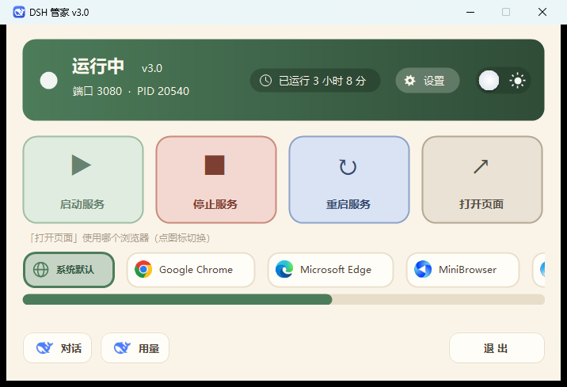
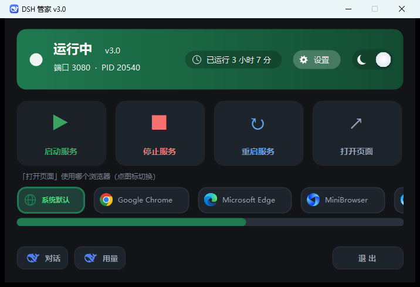
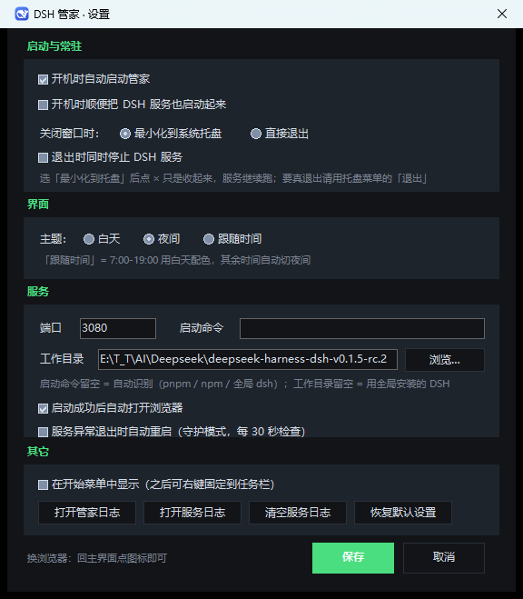

# DSH 管家 · DSH Butler

给 **DeepSeek Harness (DSH)** 本地 Web 服务用的图形化开关面板 —— 双击图标就能启动 / 停止 / 重启服务，
不用每次都回到命令行敲 `dsh web`。

当前版本 **v3.0** · Windows 10 / 11 · 系统自带 PowerShell 5.1 · **零第三方依赖**（不装 Node 包、不装运行库）



---

## 它能做什么

- **一键启停**：启动服务 / 停止服务 / 重启服务 / 打开页面，四个大按钮
- **状态一眼看到**：运行中还是已停止、端口、进程 PID、已经跑了多久
- **浏览器随便选**：主界面一排图标，点哪个「打开页面」就用哪个（自动列出系统里装了的浏览器）
- **双主题**：白天米黄 / 夜间石墨，可以手动切、也可以跟随时间（7:00–19:00 白天）
- **常驻托盘**：点 × 只是收到右下角，服务继续跑；托盘图标带状态点，悬停显示运行时长
- **开机自启**：管家自身、以及顺便把 DSH 服务拉起来，都能在设置里开关
- **守护模式**：服务意外挂了自动重启（每 30 秒检查一次）
- **顺手的小入口**：左下角两个小鲸鱼按钮，直达 DeepSeek 网页版和平台用量页

<p align="center">
  
  
</p>

## 环境要求

| 需要什么 | 说明 |
|---|---|
| Windows 10 / 11 | 界面是 WinForms，只在 Windows 上跑 |
| Windows PowerShell 5.1 | 系统自带，不用装 |
| .NET Framework 4.x | 系统自带，不用装 |
| DeepSeek Harness (DSH) | 源码运行（`pnpm dsh web`）或全局安装都行 |

## 快速开始

1. 下载 / 克隆本仓库，整个文件夹放到任意位置（**建议就放在 DSH 源码目录旁边**，管家会自动找到它）
2. 双击 **DSH管家.exe**
   （不想用 exe 也行：右键 `DSH管家.ps1` → 使用 PowerShell 运行，只是会多一个黑窗口）
3. 第一次运行会提示你选 **DSH 工作目录** —— 就是含 `package.json`、平时敲 `pnpm dsh web` 的那个文件夹
4. 点「启动服务」，好了

## 首次运行 / 配置

管家会自己找 DSH：

1. 先看自己周围 1–3 层（工具放在 DSH 旁边时直接就找到了）
2. 再看桌面 / 文档 / 下载
3. 最后扫各盘根目录下面一层

找不到才会弹提示，让你在设置面板里手动选。找到过一次就记住了。

**启动命令留空就行**，管家按环境自动挑：

| 环境 | 自动用的命令 |
|---|---|
| 源码目录 + 有 pnpm | `pnpm dsh web --no-open` |
| 源码目录 + 只有 npm | `npm run dsh -- web --no-open` |
| 全局安装的 DSH（工作目录留空） | `dsh web --no-open` |

想用别的命令（比如带参数、或者自定义启动脚本），在设置面板的「启动命令」里直接写完整命令即可。

设置存在 `%LOCALAPPDATA%\dsh-console\settings.json`，**不会往程序目录写任何东西**。

## 常见问题

**双击没反应？**
先看 `%TEMP%\dsh-butler.log`，每次启动、端口、浏览器探测、报错都在里面。

**提示找不到工作目录 / 启动服务失败？**
在设置面板里点「浏览…」选中 DSH 源码目录。判断标准：那个文件夹里应该有 `package.json`，
而且你在里面手敲 `pnpm dsh web` 是能跑起来的。

**我的 DSH 是全局安装的，没有源码目录？**
工作目录留空即可，管家会用全局的 `dsh` 命令。

**端口不是 3080？**
设置面板里改端口，管家所有地方（状态检测、打开页面、token 解析）都会跟着变。

**杀软报毒 / 不信任那个 exe？**
`DSH管家.exe` 只是个 5 KB 的启动器（作用是别弹出黑色控制台窗口），源码就在 `launcher/Launcher.cs`，
可以用 `launcher/构建启动器.ps1` 自己重新编译，或者直接删掉它、改用 `.ps1` 启动。

**怎么把它固定到任务栏？**
Windows 11 不允许程序自动固定，需要两步：设置里勾「在开始菜单中显示」→ 开始菜单找到 DSH 管家 → 右键 → 固定到任务栏。

## 目录结构

```
DSH管家.ps1          主程序（单文件，所有配置集中在文件顶部的「配置区」）
DSH管家.exe          启动器：无控制台窗口地拉起上面的脚本（可选）
DSH管家.ico          程序图标（7 个尺寸）
使用说明.txt          中文详细说明书
assets/
  deepseek-whale.png 主界面两个外链按钮用的小鲸鱼
launcher/
  Launcher.cs        启动器源码
  构建启动器.ps1      重新编译 DSH管家.exe
  launcher.ico       启动器自己的图标
docs/screenshots/    README 里的截图
```

## 自己编译启动器

```powershell
# 在 launcher 目录下
.\构建启动器.ps1
```

用的是 Windows 自带的 `csc.exe`（.NET Framework 4.x），编译产物覆盖上一层的 `DSH管家.exe`。

## 它是怎么跟 DSH 打交道的

| 干什么 | 怎么做的 |
|---|---|
| 判断服务在不在 | 检查配置的端口有没有在监听（`netstat`），不依赖进程名 |
| 启动服务 | 在 DSH 目录里执行启动命令，输出重定向到 `%TEMP%\dsh-web.log` |
| 停止服务 | 找到占用该端口的进程（PID），弹确认框后结束它 |
| 打开带 token 的页面 | 从服务日志里抓 `http://127.0.0.1:端口/?token=...`；**抓不到就退回不带 token 的地址**，不会报错 |
| 换浏览器打开 | 走系统安装的浏览器列表（注册表 `StartMenuInternet`），也可以指定某一个 |

---

## English

**DSH Butler** is a tiny GUI console for the local **DeepSeek Harness (DSH)** web server on Windows —
start / stop / restart it without touching the terminal.

- Windows 10/11, built-in Windows PowerShell 5.1, built-in .NET Framework 4.x — **no third-party dependencies**
- Four big buttons: start / stop / restart / open page; live status, port, PID and uptime
- Pick which installed browser opens the page (a row of icons on the main screen)
- Light beige / dark graphite themes, manual or time-based
- Lives in the system tray, optional auto-start on login, optional watchdog that restarts a dead server
- Interface language is Chinese (PRs welcome)

**Quick start**

1. Clone or download this repo; put the folder anywhere (next to your DSH checkout works best — it will be auto-detected)
2. Double-click `DSH管家.exe` (or run `DSH管家.ps1` with PowerShell)
3. On first run you'll be asked for your **DSH working directory** (the folder containing `package.json`, where you normally run `pnpm dsh web`)
4. Hit **启动服务** (start service)

**Auto-detection** — the launcher looks for DSH around itself, then Desktop/Documents/Downloads, then the root of each drive.
The start command is auto-selected: `pnpm dsh web --no-open`, `npm run dsh -- web --no-open`, or `dsh web --no-open` for a global install.
Leave the working directory empty to use a globally installed `dsh`.

**Logs** — `%TEMP%\dsh-butler.log` (the app itself), `%TEMP%\dsh-web.log` (the server output).
Settings live in `%LOCALAPPDATA%\dsh-console\settings.json`; nothing is ever written next to the executable.

**The .exe** is just a 5 KB launcher that hides the console window. Source is in `launcher/Launcher.cs`,
rebuild it with `launcher/构建启动器.ps1`, or delete it and run the `.ps1` directly.

## 版本演变

| 版本 | 主要变化 |
|---|---|
| v2.1 | 双主题诞生（白天米黄 / 夜间石墨）+ 日夜开关 + 渐变过渡 |
| v2.2 | 代码与目录整理，加上全局出错兜底日志（双击没反应时有据可查） |
| v2.3 | 运行时长显示 + 第一版设置面板（选浏览器 / 工作目录） |
| v2.4 | 图标体系升级（真齿轮）+ 时长改独立徽章 + 状态卡片重排 |
| v2.5 | 系统托盘常驻 + 开机自启 + 开始菜单入口 + 设置面板重做 + 守护模式 |
| v2.6 | 主界面浏览器图标条 + 底部「对话 / 用量 / 退出」+ 文字粗细整理 + 日夜开关改矢量绘制 |
| **v3.0** | **面向开源**：工作目录自动探测、启动命令自动识别、首次运行引导、启动器源码、README / 协议 / 目录整理 |

## Changelog

| Version | Highlights |
|---|---|
| v2.1 | Two themes (beige / graphite), day-night toggle, eased transition |
| v2.2 | Code and folder cleanup, global error logging |
| v2.3 | Uptime display, first settings panel |
| v2.4 | New icon set (real gear), uptime badge, status card reworked |
| v2.5 | Tray resident, auto-start, Start Menu entry, settings rework, watchdog mode |
| v2.6 | Browser icon strip, bottom bar (chat / usage / exit), typography pass, vector-drawn theme toggle |
| **v3.0** | **Open-source ready**: auto-detects the DSH folder and start command, first-run wizard, launcher source, README / license / repo cleanup |

## License

MIT — see [LICENSE](LICENSE).
